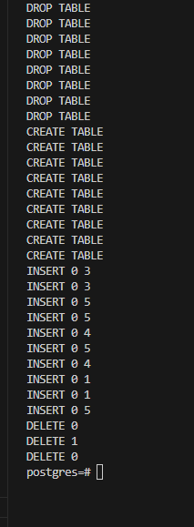
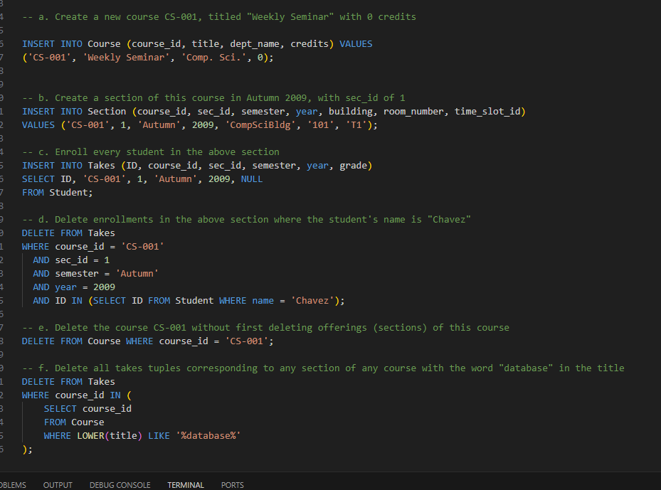

# DSC-E3.12

Write the following queries in SQL using the university schema.

a. Create a new course CS-001, titled "Weekly Seminar" with 0 credits.

b. Create a section of this course in Autumn 2009, with sec_id of 1, in the Comp. Sci. department.

c. Enroll every student in the above section.

d. Delete enrollments in the above section where the student's name is "Chavez."

e. Delete the course CS-001 without first deleting offerings (sections) of this course.

f. Delete all takes tuples corresponding to any section of any course with the word "database" as part of the title; ignore case when matching.

